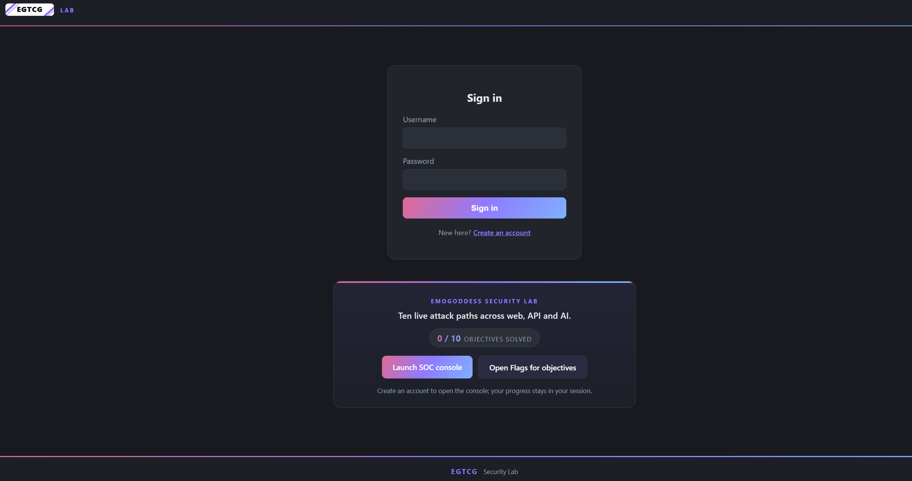
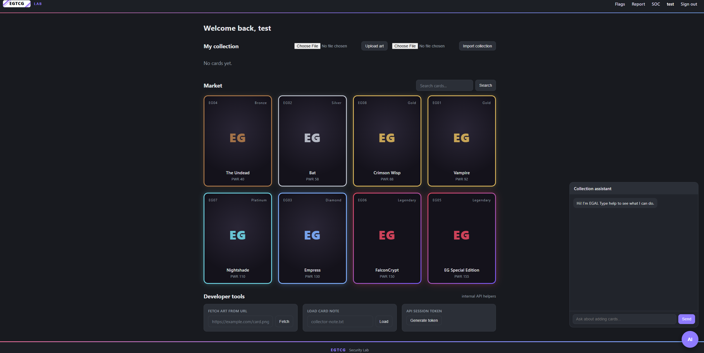
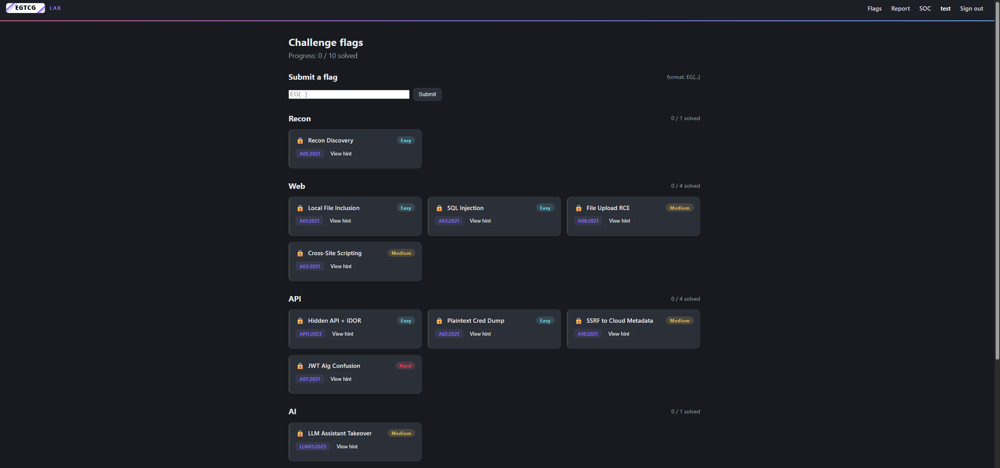
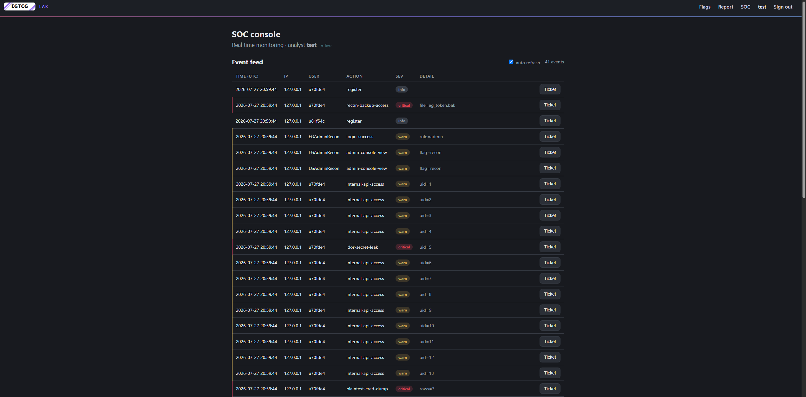

# EGTCG EmoGoddess Lab


A deliberately vulnerable web app for practicing offensive security, SOC
operations, and threat hunting. Ten challenge paths across the OWASP Web, API,
and LLM Top 10, with a built in SOC console and SIEM ready logging. Runs locally.

## Legal and responsible use

This app is 100% vulnerable by design.

- Education and personal practice only, on a system you own.
- Do not host it publicly. Run it on localhost.
- No warranty. The author is not responsible for misuse. Use it at your own risk.
- Licensed under the MIT License (see [`LICENSE`](LICENSE)).

## Setup

Requires Python 3.11 or newer.

```bash
git clone https://github.com/EmoGoddess/emogoddess-seclab.git
cd emogoddess-seclab
python -m venv venv
venv\Scripts\activate        # Windows
source venv/bin/activate     # macOS or Linux
pip install -r requirements.txt
python init_db.py
python app.py
```

Open <http://127.0.0.1:5000>, create an account, and track progress on the Flags
page.

## SOC and SIEM

Every security event goes to two places.

- **In app console.** Open `/soc` for
  a live feed, IP blocking, and tickets.
- **JSON log.** `logs/access.log` holds one JSON object per line with the fields
  `action`, `severity`, `ip`, `user`, `method`, `path`.

**ELK.** Ship the log with Filebeat, then build detections in Kibana.

```yaml
filebeat.inputs:
  - type: filestream
    paths: ["/path/to/emogoddess-seclab/logs/access.log"]
    parsers:
      - ndjson: { target: "" }
output.elasticsearch:
  hosts: ["http://localhost:9200"]
```

**Wazuh.** Add a localfile decoder for `logs/access.log` with `log_format json`
and write rules on the `action` field.

**Splunk.** `splunk add monitor /path/to/logs/access.log -sourcetype _json`

## Screenshots

| Login | Dashboard |
|-------|-----------|
|  |  |
| **Flags** | **SOC console** |
|  |  |

## Challenge paths

| Challenge | Category | Difficulty | OWASP |
|-----------|----------|-----------|-------|
| Recon Discovery | Recon | Easy | A05:2021 |
| Local File Inclusion | Web | Easy | A01:2021 |
| SQL Injection | Web | Easy | A03:2021 |
| Cross Site Scripting | Web | Medium | A03:2021 |
| File Upload RCE | Web | Medium | A08:2021 |
| Hidden API and IDOR | API | Easy | API1:2023 |
| Plaintext Credential Dump | API | Easy | A02:2021 |
| SSRF to Cloud Metadata | API | Medium | A10:2021 |
| JWT Algorithm Confusion | API | Hard | A07:2021 |
| LLM Assistant Takeover | AI | Medium | LLM01:2025 |

**Coverage.** Web Top 10 (2021): A01, A02, A03, A05, A07, A08, A10. API Top 10
(2023): API1, API7. LLM Top 10 (2025): LLM01, LLM02, LLM05, LLM07.

## Flag protection

Flags never appear in plaintext in the repo. Obfuscated defaults decode into a
gitignored `secret/` at build time, and each flag is only reachable by running
its path. Keys, flag store, and database are gitignored.

## Structure

```
app.py         # routes and all paths
init_db.py     # builds DB, keys, tokens, obfuscated defaults
templates/     # pages
static/        # css, js, art
secret/        # (gitignored) flags, config, RSA key
logs/          # (gitignored) access.log for the SIEM
```

## Notes

- Every path was built and tested by me, edited by hand and pentested end to end.
  The lab is 100% functional.
- A full writeup for every path is in progress. It is long, so it will go up over
  the coming weeks or months depending on how busy things get.
- The LLM assistant and the XSS moderator bot are simulated server side (no
  external model, no headless browser) so the lab stays self contained. The
  techniques mirror the real attacks.
- Parts of this project were written and refactored with the help of Claude AI.
